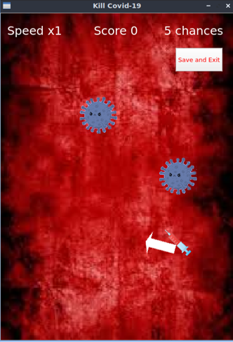
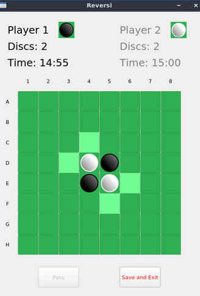

# QT-Games
A gaming framework implemented in QT as part of the EECE 435L course.\
It contains 2 complete games, Kill-Covid 19 and Reversi.\
A user can create an account, save game progress and view top scores for each game.

      **Game 1: Kill Covid-19                  Game 2: Reversi**\
\
      
